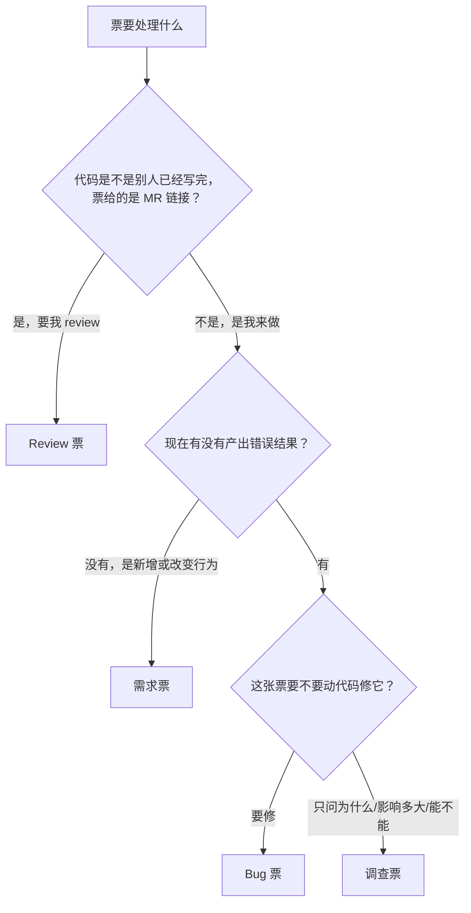

# System Analysis Review

## Purpose

Use this skill as a mandatory quality gate for ticket analysis HTML. It prevents shallow ticket summaries by forcing the analysis to connect Backlog expectations to actual code, data, modules, risks, tests, and rollout work.

For the full standards extracted from `ai-workspace/docs/systemAnalyse/系分入门(系分要什么)_2014_宿莽整理与鲁肃系分 ppt 大体一致 (1).pptx`, read `references/pptx-system-analysis-standards.md` whenever drafting or reviewing a ticket analysis.

## Step 0: Classify the Ticket

**Do this before anything else. It picks the template, and the wrong template cannot be rescued by good content.**

There is no single ticket-analysis shape. A 需求票 has no cause to trace; a Bug 票 is worthless without one; a 调查票 has no change to plan; a Review 票 has no plan at all, because the work is already written by someone else. One template forced onto all of them produces the failure this skill exists to stop: every section filled, and the question the ticket asked still unanswered.

Three questions decide it:


<p align="center">票型判定：三个问题决定模板</p>

| 票型 | 交付物 | 节次 |
| --- | --- | --- |
| **需求票** | 要做成什么，怎么做 | 目标 / 业务分析 / 数据分析 / 系统分析 / 修改方案 / 测试方案 / 上线方案 |
| **Bug 票** | 为什么错，怎么修 | 目标 / 现象与复现 / 根因分析 / 影响范围 / 修改方案 / 测试方案 / 上线方案 |
| **调查票** | 问题的答案 | 目标 / 现象与复现 / 根因分析 / 影响范围 / 结论与建议 / 验证方式 |
| **Review 票** | 对别人代码的评审意见 | 目标 / 变更概览 / Review 结论 / 问题清单 / 测试与验证意见 / 需要确认的点 |

The first three are not arbitrary. **Bug 票 = 调查票的前半 + 需求票的后半**: it must explain the defect like an investigation, then plan the change like a requirement. That is why it is its own template rather than either one stretched.

**Review 票 is the odd one out**: the other three describe work that has not happened yet, and a Review 票 judges work that already exists. Nothing in it is a plan, the code is not yours to change, and its deliverable is a verdict with evidence. It is covered here because it arrives at the same gate and gets misclassified as a 需求票 more often than anything else — the MR description reads like a requirement, and a document that restates it has reviewed nothing.

Rules that follow from the model:

- **需求票 has no 根因分析.** Nothing is broken, so there is no chain to trace, and inventing one produces fiction. Its 业务分析/数据分析/系统分析 map the intended behavior onto the code instead.
- **Bug 票 has no 业务分析/数据分析/系统分析 as separate sections.** Tracing a defect already walks the business flow, the data, and the implementation path — that *is* what a causal chain is. Keeping all four makes the writer say the same thing four times, which is where padding comes from. Business rules, data ownership, and implementation paths appear inside 根因分析 as links of the chain, and inside 修改方案 as change points.
- **调查票 has no 修改方案/测试方案/上线方案.** There is no change in this ticket. If the investigation concludes one is needed, its shape goes in 结论与建议 and the change ticket that follows gets its own 系分.
- **影响范围 exists only on Bug and 调查.** It is about damage already done — wrong stored data, who is affected, since when. A 需求票 has none of that; its scope lives in 目标 and 修改方案.
- **Review 票 plans nothing and changes nothing.** No 修改方案, no 上线方案, no 根因分析 of its own. You do not edit the code, commit, push, approve the merge request, or merge it. Findings say what is wrong and how the author should fix it; the author fixes it.

The optional **修订历史&背景** section may appear on any type, immediately after 目标, holding revision history, version/scope attribution, prior-ticket relationships, and source background pulled out of 目标. Omit it entirely rather than leaving an empty shell.

### Declaring the type

State the ticket type in one line at the top of 目标, so a reviewer can challenge the classification instead of guessing at it: `票型：Bug 票`. A document whose content does not match its declared type fails the audit.

### Ambiguous and mixed tickets

- A ticket carrying a merge-request link where the code is already written by someone else is a **Review 票**, whatever its title says. This is the classification that goes wrong most often: the MR description reads like a requirement, and drafting a 需求票 from it produces a document that restates the author's own summary and reviews nothing.
- A ticket that fixes a defect **and** adds behavior is a **Bug 票**; the added behavior goes in 修改方案. Do not split one ticket into two documents.
- A ticket phrased as a question that the requester obviously wants fixed in the same ticket is a **Bug 票**. Ask what the deliverable is, not how the sentence is worded.
- A ticket asking 能不能这样做 / 改了会怎样, where nothing is currently wrong, is a **调查票** — the "现象" is the current behavior and the question is about consequences.
- A Review 票 whose review concludes the change is wrong stays a **Review 票**. Write the finding; do not switch to a Bug 票 and start planning the fix yourself.
- When two readings survive the questions above, pick the one that costs more to be wrong about (usually Review over 需求, Bug over 需求, 调查 over Bug) and say in 目标 why the classification was uncertain.

## Review Requirements

Applies to **Review 票**. The deliverable is a verdict backed by evidence, and it fails the same way a root cause fails: by asserting a judgement nobody can check.

**Read the diff, not the description.** 变更概览 is written from `glab mr diff`, file by file. A 变更概览 that could have been produced from the merge-request description alone is proof the code was not read, and is blocking. Where the diff and the description disagree, that disagreement is itself a finding.

Every finding carries four things:

1. **文件:行** — in the diff under review, not elsewhere in the repository.
2. **问题** — what the code does.
3. **会导致什么** — the concrete consequence: which input produces which wrong result, which case throws, which query degrades, which caller breaks. A finding with no consequence is a preference, not a finding.
4. **具体改法** — the minimal change that fixes it, concrete enough to apply.

Rank findings by severity and lead with the blocking ones: **阻塞**（正确性、数据、并发、安全、兼容性）→ **应改**（可维护性、异常处理、日志、测试缺口）→ **建议**（风格、命名）. Group repeated instances of one rule rather than listing each occurrence.

「这里写得不好」「建议优化一下」「不太规范」 are not findings, for the same reason 「因为逻辑有误」 is not a root cause: they restate a feeling without saying what breaks.

Run the **`p3c-review`** skill against the merge request's branch for the Java standards pass, and fold its `priority 1/2` output into 问题清单 as evidence. It does not replace reading the diff: it finds rule violations, not wrong business logic, and business logic is what the review is for.

**When the merge request fixes a bug, check the fix against the cause.** Read the linked ticket or analysis, establish what the actual cause was, and say whether the change addresses it or patches a downstream symptom. A fix that makes the reported symptom disappear without touching the cause is a 阻塞 finding.

The verdict is one of **通过 / 有条件通过 / 打回**, stated in 目标 and again in Review 结论 with its reason. 有条件通过 must name exactly which findings are the conditions. A review with 阻塞 findings cannot be 通过.

Do not modify the code, commit, push, comment on the merge request, approve it, or merge it. The document is the deliverable; the operator carries it back to the author.

## Root Cause Requirements

Applies to **Bug 票 and 调查票**. This is the part a shallow document skips, so it is spelled out.

A root cause is a **chain**, not a label. Every link carries three things:

1. **代码位置** — file path plus class/method, or config/data location.
2. **该处的实际行为** — what that code actually does with the actual input, in concrete values where values matter.
3. **为什么导致下一步** — what that behavior makes the next link do.

The chain runs from the trigger the user hit to the wrong result the user saw, with no gap where the document says "然后就错了". It ends by naming **one** defective point: the single place where the code's behavior first diverges from what the business needs. "多个原因共同导致" is acceptable only when each cause has its own complete chain.

Statements that assert a cause without a code location are not root causes and fail the audit: 「因为逻辑有误」「因为未考虑该场景」「因为存在缺陷」「因为数据不一致」「因为设计如此」. Each describes the symptom again in different words.

The section must also show **实际流程 vs 预期流程**: one Mermaid diagram, or two side by side, with the divergence point visibly marked. A reader must be able to see where reality leaves the intended path without reading the prose twice.

When the cause cannot be reached — missing logs, unreproducible, needs production data — say so explicitly, name what evidence would settle it and how to get it, and mark the document 未定论. An honest 未定论 passes; a confident guess dressed as a conclusion fails.

## Mandatory Workflow

1. Read the target HTML before editing.
2. Read ticket body and comments when the task is ticket-bound.
3. **Classify the ticket (需求 / Bug / 调查 / Review) and take its template.** Everything below is done against that template.
4. Read design materials when referenced or available, including Excel/Sheets, Figma, screenshots, specs, attached files, and linked tickets; extract their concrete requirements before judging coverage.
5. Read conversation-added requirements from the current chat, including corrections and newly stated rules, and treat them as expected items for the current HTML.
6. Read code, tests, config, and existing docs enough to map the real business and system flow.
7. For Bug and 调查: trace the causal chain in the code until you can name the one defective point, or until you can name exactly what evidence is missing.
8. For Review: read the merge request's diff with `glab mr diff`, file by file, and run the `p3c-review` skill against its branch. Read the linked ticket to know what the change was supposed to do.
9. Draft the HTML using the template from step 3.
10. Run the audit checklist below before saving or delivering, including source-vs-HTML coverage comparison.
11. If any blocking item fails, rewrite the document and audit again.
12. Only deliver after the audit passes.

Every modification to a ticket analysis HTML must pass this skill after the modification. A failed audit means the current draft must be treated as unfit for delivery.

## HTML Composition Rules

Use the template's section set, and choose the lightest useful carrier inside each section.

- Prefer paragraphs for conclusions, causes, scope, and narrative explanations.
- Prefer short unordered lists for conditions, risk points, and verification results.
- Do NOT use HTML tables. Render any row/column, matrix, mapping, dictionary, or checklist content as a Mermaid diagram or a concise list instead. Any `<table>` in the delivered HTML is a blocking failure.
- Enforce per-section caps on explanatory prose. Diagrams, code identifiers, field/path tokens, **and the causal chain** do not count toward them.

| 节次 | 需求票 | Bug 票 | 调查票 | Review 票 |
| --- | --- | --- | --- | --- |
| 目标 | ≤ 100 | ≤ 100 | ≤ 100 | ≤ 100 |
| 修订历史&背景（按需） | ≤ 200 | ≤ 200 | ≤ 200 | ≤ 200 |
| 现象与复现 | — | ≤ 200 | ≤ 200 | — |
| 根因分析 | — | 不设上限 | 不设上限 | — |
| 影响范围 | — | ≤ 200 | ≤ 200 | — |
| 业务分析 / 数据分析 / 系统分析 | ≤ 100 each | — | — | — |
| 修改方案 | ≤ 100 | ≤ 200 | — | — |
| 测试方案 | ≤ 200 | ≤ 200 | — | — |
| 上线方案 | ≤ 100 | ≤ 100 | — | — |
| 结论与建议 | — | — | ≤ 300 | — |
| 验证方式 | — | — | ≤ 200 | — |
| 变更概览 | — | — | — | ≤ 300 |
| Review 结论 | — | — | — | ≤ 200 |
| 问题清单 | — | — | — | 不设上限 |
| 测试与验证意见 | — | — | — | ≤ 200 |
| 需要确认的点 | — | — | — | ≤ 200 |

- **根因分析 is uncapped because it is the deliverable.** The caps exist to kill padding, and a chain of 代码位置→实际行为→为什么导致下一步 is the opposite of padding: cutting it to fit produces the assertion-without-evidence the audit rejects. A chain that runs long because it repeats itself or narrates the investigation is padding again — cut the repetition, not the links.
- **问题清单 is uncapped for the same reason**: it is one entry per finding, each carrying 文件:行 + 问题 + 会导致什么 + 具体改法, and there is no budget at which those four can be dropped. Length comes from the number of findings, not from prose around them. A clean merge request produces a short 问题清单, and that is a passing outcome, not a missing one.
- Keep each section result-first: start with the answer, then give evidence and boundaries. Cut ticket-number paraphrase, generic statements, and synonymous repetition.
- HTML ticket analysis must be Chinese-led. Use Chinese for section titles, conclusions, diagram node labels, and narrative text. Keep Japanese/English only for original UI terms, code identifiers, API paths, class/method names, error messages, item IDs, field names, and direct evidence.
- Keep diagrams for flow, collaboration, state, or ownership. Do not restate the same information in two diagrams unless the second adds a different lookup value.
- Diagram captions must name the concrete flow/data/model being shown, such as a specific save flow, data definition, state transition, or system sequence. Avoid hard-coded generic captions such as `业务流程图`, `ER 图（含继承关系）`, or `系统协作图`. Place each caption immediately below the diagram and center it, using the shared `diagram-caption` style or an equivalent centered `figcaption`.
- For compact tickets, one diagram plus a few short paragraphs/lists is enough.
- Ticket context HTML is a desktop review artifact by default; mobile layout is out of scope unless the user explicitly asks for it.

## Blocking Audit Checklist

The document fails if any item below is missing or only asserted without code evidence.

### 票型与模板 — runs first, on every ticket

- **票型已声明**: 目标 carries the ticket type in one line. Missing declaration is blocking.
- **票型判断正确**: the declared type survives the three questions in Step 0. A 需求票 covering something that currently produces a wrong result, a Bug 票 where nothing is broken, or anything other than a Review 票 for a ticket whose code is already written and handed over as a merge request, is misclassified and blocking.
- **模板匹配票型**: the section set is exactly the declared type's. A 调查票 carrying 修改方案/上线方案, a Bug 票 carrying 业务分析/数据分析/系统分析 as separate sections, a 需求票 carrying 根因分析, or a Review 票 carrying 修改方案/上线方案 is blocking on its own, before content is read.
- **回答了票问的问题**: the ticket asked something specific. Fail the document if that question has no direct answer in it, however complete the rest looks.

### 根因 — Bug 票 and 调查票

A document that describes the current behavior without saying why it happens is not an analysis; it is the ticket restated with more words. These outrank everything below.

- **因果链完整**: the chain from trigger to wrong result has no gap. Every link carries 代码位置 + 该处的实际行为 + 为什么导致下一步. A step stating what happened without why it made the next step happen is a gap, and blocking.
- **根因有代码位置**: fail on any cause asserted without a file/class/method/config location — 「因为逻辑有误」「因为未考虑该场景」「因为存在缺陷」「因为数据不一致」「因为设计如此」 and their synonyms are symptom restatements, not causes.
- **单一缺陷点**: the chain names the one place where behavior first diverges from what the business needs. Multiple causes are allowed only when each carries its own complete chain.
- **实际 vs 预期流程**: the divergence is shown as a diagram with the divergence point marked, not left to prose alone.
- **影响范围有依据**: each number, date range, or affected set is established by a query or code path, not estimated.
- **未定论要说清**: a document that cannot reach a cause passes only if it names the missing evidence and how to obtain it, and marks itself 未定论. A guess presented as a conclusion is blocking.
- **修改方案对准根因**（Bug 票）: the change point is the defective point the chain named, or the document says why it is fixed elsewhere. A fix that patches a downstream symptom without saying so is blocking.
- **结论回答了要不要改**（调查票）: 结论与建议 states whether a change is needed and either where and why that is the minimal point, or why no change is warranted.

### Review — Review 票

A document that summarises the merge request without judging it has reviewed nothing. These outrank everything below.

- **读了 diff**: 变更概览 is written from the actual diff, per file. Fail it if it could have been produced from the merge-request description alone — matching the author's own wording, or covering only what the description mentions while the diff touches more.
- **结论明确**: the verdict is 通过 / 有条件通过 / 打回, in 目标 and in Review 结论, with its reason. 有条件通过 names exactly which findings are the conditions. A verdict of 通过 alongside any 阻塞 finding is blocking.
- **每条问题有后果**: every finding carries 文件:行 + 问题 + 会导致什么 + 具体改法. 「写得不好」「建议优化」「不太规范」 without a concrete consequence is a preference, not a finding, and is blocking.
- **问题按严重度排序**: 阻塞 first, then 应改, then 建议. Repeated instances of one rule are grouped.
- **p3c 已跑**: the `p3c-review` skill was run against the merge request's branch and its priority 1/2 output is reflected in 问题清单 or explicitly dismissed with a reason. Its absence is blocking; its presence alone is not sufficient, since it finds rule violations, not wrong business logic.
- **修复对准根因**: when the merge request fixes a defect, the review states whether the change addresses the actual cause or patches a downstream symptom. Not judging this is blocking.
- **没有动别人的代码**: the review made no edit, commit, push, merge-request comment, approval, or merge. Any of those is blocking regardless of document quality.

### 通用

- **来源覆盖对照**: must compare the generated HTML against all requirement sources used or mentioned in the task: design docs such as Excel/Sheets/Figma/screenshots/specs, Backlog body, Backlog comments, linked tickets, and conversation-added requirements. Every concrete requirement, field, event, validation, exception, data item, flow, dependency, open question, and acceptance point must either appear in the appropriate section or be explicitly marked out of scope with a reason. Missing source requirements are blocking findings.
- **目标**: after the 票型 line, must split business target and system target, each stated in a single short sentence. The business target = the payroll/business result; the system target = the code-level state to achieve plus the affected modules and data contract. If either cannot be expressed in one sentence, the goal is not understood and must be condensed. For a 调查票, the system target is replaced by the answer itself; for a Review 票, by the merge request under review and the verdict. The section fails if it contains 改訂履歴/version history, prior-ticket scope attribution, scope-boundary or 「明确范围外」 lists, source-vs-HTML coverage enumerations, or Backlog/design/chat background — move all of that to 修订历史&背景.
- **修订历史&背景（按需）**: present only when the ticket actually carries revision history, version/scope attribution, prior-ticket relationships, or source background worth recording. When present it holds exactly the historical/attribution content stripped out of 目标, sits immediately after 目标, and is omitted entirely for simple tickets rather than left empty. It fails if it absorbs analysis that belongs in the other sections.
- **Visuals**: process-style analysis must include diagrams. Use Mermaid flowchart/sequence/class/state/ER diagrams for flow, collaboration, state, and data relationships. Each diagram must have a concrete centered caption immediately below it. Impact, field lookup, coverage, and rollout ordering are expressed as lists or diagrams, never tables.
- **Evidence**: every major conclusion must cite concrete file paths, class/method names, item IDs, fields, query conditions, or source artifacts such as design sheet/tab names, Backlog issue/comment IDs, attachment names, and chat-stated requirement text.
- **No filler**: remove repeated sentences, ticket-only paraphrase, generic statements, and ungrounded recommendations.
- **No source omission**: fail the document if an Excel/design-sheet item, Backlog expectation/comment, linked-ticket condition, or chat-added requirement is absent without an explicit out-of-scope note.
- **No tables**: fail the document if it contains any HTML `<table>`. All row/column, matrix, mapping, dictionary, and checklist content must be rewritten as a Mermaid diagram or a concise list.
- **Length caps**: fail the document if any section's explanatory prose exceeds its cap in the table above (diagrams, code/field/path tokens, and the causal chain excluded).

### 需求票 sections

- **业务分析**: must describe the involved business process in business language only, including actor/trigger, normal path, business rules, business exceptions, current business result, and expected business result. It must not contain API paths, class names, service names, method names, file paths, code identifiers, DTO/entity implementation names, or storage/CRUD terms. Move those to 数据分析 or 系统分析.
- **数据分析**: must trace code data flow, data owners, input fields, stored fields, derived fields, query keys, value precedence, default/null behavior, and historical data/backfill implications. It must include an ER diagram or Mermaid entity/data relationship graph showing relevant persistent entities/DTOs, owned fields, relationships/cardinality where applicable, inheritance chain for the main persistent DTOs up to `AuditableData`, and which module reads or writes each entity. `AuditableData` should be shown by class name only, without fields/details.
- **系统分析**: must map business steps to concrete implementation paths and explain modification points, related logic, impact range, external/internal services, persistence access, exception handling, transaction/update behavior, and v1/v2 or common module boundaries. It must not be a class-name list. When several files or modules are involved, give one concise list item per path (实现路径→修改点→相关逻辑→影响), never a table.

### Bug 票 and 需求票 shared change sections

- **修改方案**: must include concrete change points, alternatives when meaningful, chosen plan with reason, impact range, compatibility, data migration/backfill decision, exception/logging decision, and why the change is minimal under the current architecture. On a Bug 票 it must also decide what happens to already-wrong stored data.
- **测试方案**: must provide test scope, cases, expected values, line/branch/business path coverage target, regression scope, existing test gap, and execution command or verification route. On a Bug 票 one case must reproduce the original defect and fail without the fix.
- **上线方案**: must state deploy scope, historical data handling, release order, rollback, monitoring/verification points, user-visible risk, and whether any operation or migration is required.

## Diagram Requirements

Include at least one diagram for flow-oriented ticket analysis. Choose based on the question the section answers.

Required per type:

- **需求票**: business `flowchart` in 业务分析, `erDiagram` in 数据分析, `sequenceDiagram` in 系统分析. A state diagram when confirm status, history, backfill, or migration matters.
- **Bug 票**: causal-chain `flowchart` with 实际 vs 预期 in 根因分析. Add an ER or sequence diagram only where the chain alone cannot show data ownership or cross-service ordering.
- **调查票**: same causal-chain diagram in 根因分析. Everything else only if it earns its place.
- **Review 票**: no diagram is required. The deliverable is a ranked findings list, and a diagram of someone else's change is decoration. Add one only where a finding is about flow, ordering, or state that the diff cannot show — for example a concurrency window or a changed state transition — and then it belongs beside that finding, not in 变更概览.

Diagram forms:

- Root cause: a `flowchart` of the causal chain, one node per link, running trigger → 各代码位置的实际行为 → wrong result, with the divergence from the expected path marked. Show the expected path in the same diagram as a parallel branch, or as a second diagram beside it. A node labelled with only a class name says nothing; label it with what that code does.
- Business flow: `flowchart` with business trigger, calculation step, storage/read step, and output.
- System collaboration: `sequenceDiagram` with API/service/util/storage participants.
- Data ownership: `erDiagram` or Mermaid graph showing entities/DTOs, source, owner, field, consumer, fallback, relationship/cardinality where applicable, and inheritance chain for the main persistent DTOs up to `AuditableData`. Show `AuditableData` by class name only. Add field-level detail as a short list only if needed.
- State/history: a state diagram when confirm status, history, backfill, or migration matters.

## Section Carrier Guidance

Never use tables. Caps are in the table under HTML Composition Rules.

### 共通

- **目标**: the 票型 line, then exactly two short one-sentence statements — business target and system target (for a 调查票, the answer). Keep it pure: no revision history, no scope attribution, no source lists, no boundary declarations. Surplus belongs in 修订历史&背景.
- **修订历史&背景（按需）**: only when there is real history/attribution/background. A short list for 改訂履歴版本归属、前置票关系、范围边界与「明确范围外」、来源对照（Backlog 正文/评论、设计书、聊天追加）; omit the whole section for simple tickets.

### 需求票

- **业务分析**: a few short sentences plus one business flowchart. Lists for business rules and exception conditions. Diagram labels must be business actions/outcomes, not API calls, classes, methods, DTOs, services, or storage operations.
- **数据分析**: brief prose for data flow plus an ER diagram near the beginning, showing the main persistent DTO inheritance chain up to `AuditableData`. Field-level detail as a short list, not a table.
- **系统分析**: one sequence diagram plus a concise list. One list item per implementation path (实现路径→修改点→相关逻辑→影响); never bare class/route/method/file names without saying why each changed and what it affects.

### Bug 票

- **现象与复现**: what was observed, on which data, in which environment, and the exact steps or conditions that reproduce it. Concrete values, item IDs, dates, and 社員/対象 identifiers where they matter. When it does not reproduce, say what was tried.
- **根因分析**: the causal chain plus the 实际 vs 预期 diagram, under Root Cause Requirements. One list item per link. This section absorbs what a 需求票 splits across 业务分析/数据分析/系统分析 — the business rule that was violated, the data that carried the bad value, and the implementation path that produced it are links of the chain, stated once.
- **影响范围**: who and what else is hit — which 社員/月/事業所/機能, how many, since when, whether stored data is already wrong, and whether anything downstream consumed it. Bullets with the query or code path establishing each number.
- **修改方案**: a short chosen-plan statement pointing at the defective point the chain named, plus the decision on already-wrong stored data. One list item per option when comparing real alternatives.
- **测试方案**: bullets, one per case with expected value, coverage, and the command/verification route. One case must fail without the fix.
- **上线方案**: bullets for release order, rollback, historical data repair, and monitoring.

### 调查票

- **现象与复现**: as for Bug 票. When the ticket asks about a hypothetical rather than a defect, this section describes the current behavior the question is about.
- **根因分析**: as for Bug 票. Uncapped, and the one section where length is earned rather than tolerated.
- **影响范围**: as for Bug 票.
- **结论与建议**: whether a change is needed, and either where it should be made and why that is the minimal point, or why no change is warranted. When a change ticket should follow, say what it must cover. Not a 修改方案 — no rollout, no test plan, no migration steps.
- **验证方式**: how the conclusion itself can be checked — the query, log, test, or reproduction route that would confirm or refute it. This is what makes the analysis falsifiable rather than merely plausible.

### Review 票

- **目标**: the 票型 line, the merge request under review (URL and branch), what the change claims to do, and the verdict in one sentence. A reader who stops here knows whether it passes.
- **变更概览**: what the diff actually changes, one short list item per file or class — 改了什么→为什么这么改（按作者的意图理解）→你读出的实际影响. Written from `glab mr diff`, never from the merge-request description. Where the two disagree, say so here and open a finding.
- **Review 结论**: 通过 / 有条件通过 / 打回, with the reason in two or three sentences. 有条件通过 names which findings are the conditions.
- **问题清单**: one entry per finding, grouped under 阻塞 / 应改 / 建议, each with 文件:行、问题、会导致什么、具体改法. Uncapped. Fold the `p3c-review` priority 1/2 output in here, or say why a violation is dismissed. Group repeated instances of one rule.
- **测试与验证意见**: whether the merge request's own tests cover the change, what case is missing, what regression scope the reviewer would want run, and whether CI's green result actually proves anything about this change.
- **需要确认的点**: questions for the author — things that look wrong but may be intentional, unclear business intent, decisions that need a second opinion. Keeping these separate from 问题清单 is what stops a question from reading as a defect.

## Pass/Fail Output

When auditing, produce a short internal result:

```text
Audit: PASS/FAIL
票型: 需求/Bug/调查/Review
Blocking gaps:
- ...
Required rewrite:
- ...
```

Do not deliver a failed document. Rewrite first, then audit again.
