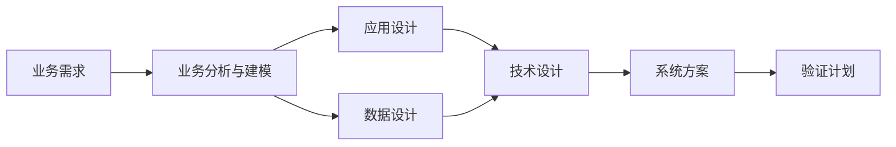

# PPTX System Analysis Standards

Source: `ai-workspace/docs/systemAnalyse/系分入门(系分要什么)_2014_宿莽整理与鲁肃系分 ppt 大体一致 (1).pptx`

## Core Model

System analysis is `业务分析 + 系统设计`. It starts from business and technical requirements, respects architecture and project constraints, then evaluates tradeoffs and produces a system solution.

Required chain:

## Source Coverage Requirements

Before accepting an analysis, build a source coverage map from every concrete requirement source available in the task:

| Source | Required Coverage Check |
| --- | --- |
| Design docs such as Excel/Sheets/Figma/screenshots/specs | Fields, events, validations, UI states, data definitions, formulas, exception messages, workflow steps, dependencies, and open questions |
| Backlog body/comments | Expectations, comment corrections, linked tickets, attachments, delivery scope, and acceptance notes |
| Conversation-added requirements | New constraints, corrections, output format rules, review rules, and user-stated omissions from the current chat |
| Code/tests/config | Actual implementation path, data flow, existing behavior, test coverage, and changed diff surface |

Every item from the source coverage map must be represented in the HTML in the right section, or explicitly marked out of scope with a reason. Any missing concrete item is a reject.

## Ticket Types

The source PPTX describes one kind of work: deciding what the system should become. That is a 需求票, and everything below about business modeling, application design, and data design is written for it. Three other kinds of ticket arrive at the same gate and need a different document:

| 票型 | 问的问题 | 交付物 | 本文适用部分 |
| --- | --- | --- | --- |
| 需求票 | 要做成什么 | 变更方案 | 全部 |
| Bug 票 | 为什么错，怎么修 | 根因 + 变更方案 | Root Cause + System Design + 验证 |
| 调查票 | 为什么/影响多大/能不能 | 答案 | Root Cause + 验证 |
| Review 票 | 别人写的这份改动行不行 | 结论 + 问题清单 | Design Quality Principles（作为评判标准） |

Classify before drafting. The PPTX chain 业务需求 → 业务分析与建模 → 应用/数据设计 → 技术设计 → 系统方案 → 验证计划 is the 需求票 chain; a Bug 票 enters it only from 系统方案 onward, after the causal chain has established what is actually wrong; a 调查票 stops at the cause and its verification; a Review 票 runs the chain backwards, reading a finished change and asking whether each step of it holds up.

For a Review 票, the Design Quality Principles below are the yardstick rather than the instructions: 局部化改动、关注点分离、模块边界（耦合/内聚/信息隐藏/作用域）、可维护性归属、方案取舍是否有理由. A finding is what happens when the change violates one of them *and* that violation has a concrete consequence.

## Root Cause Requirements

Applies to Bug 票 and 调查票 — every ticket that is not purely additive. The source PPTX does not cover it: it asks what the system should become, and these tickets ask the prior question, **why does the current code produce this result**.

A root cause is a chain, not a label. Each link:

| Element | Required Content |
| --- | --- |
| 代码位置 | file path plus class/method, or the config/data location |
| 实际行为 | what that code does with the actual input, in concrete values where values matter |
| 导致下一步的原因 | what that behavior makes the next link do |

The chain runs unbroken from the user's trigger to the user's wrong result, and ends by naming one defective point: where behavior first diverges from what the business needs.

These are not causes, and a document that offers one has restated the symptom: 「逻辑有误」「未考虑该场景」「存在缺陷」「数据不一致」「设计如此」.

An investigation that cannot reach a cause is finished honestly by naming the missing evidence, how to obtain it, and marking itself 未定论.

## Business Analysis Requirements

Business analysis must cover only business-language content. Do not put API paths, classes, services, methods, DTO names, file paths, storage operations, or code identifiers in business analysis; move them to data/system analysis.

Business analysis must cover:

| Area | Required Content |
| --- | --- |
| Product value | why the problem matters to users or operations |
| Problem | current business result and incorrect system behavior |
| Target | expected business result and acceptance condition |
| Scenario | actor, trigger, process, business rule, output |
| Service boundary | involved business service, owner, upstream/downstream |
| Rules | calculation, precedence, effective date, status, fallback |
| Business impact | current process, related process, common concern impact |
| Business exceptions | cases that cannot be fully prevented by code, and handling |

Service-oriented business modeling steps:

1. Analyze main business flow.
2. Analyze main business service.
3. Design business domain boundaries.
4. Design collaboration between domains.
5. Design service boundaries and data boundaries.
6. Analyze impact to existing business.
7. Analyze business exceptions and handling.

## System Design Requirements

System design must bridge business model to application model, data model, and technical support.

Application part:

| Step | Required Question |
| --- | --- |
| Application boundary | which module/system owns the behavior |
| Collaboration | which classes/services interact and in what order |
| External interface | API or UI entry and user-visible behavior |
| Internal service | service/helper/util contract and parameters |
| External customer impact | behavior change visible to caller |
| Internal system impact | caller/callee/test/config impact |
| Internal structure | concrete implementation path, modification point, related logic, impact range, class/method responsibility, and module dependency |

Data part:

| Step | Required Question |
| --- | --- |
| Data subject domains | which entities own the values |
| Data relationships | source field, derived field, stored field, consumer field |
| Application-data relation | which module reads/writes each field |
| Internal data structure | DTO/map/item ID/type/null/default |
| Access pattern | query condition, sorting, limit, status filter, cache |
| Historical data | whether existing stored data must be repaired or left intact |
| Analytical data | whether reporting/export/calculation formulas are affected |

Technical/non-functional part:

| Concern | Required Analysis |
| --- | --- |
| Accuracy | how expected result is guaranteed and verified |
| Maintainability | who maintains what; minimum module change; reduced chain reaction |
| Testability | unit/integration/API coverage and branch coverage target |
| Compatibility | v1/v2/common boundaries and old data behavior |
| Observability | logging, failure signal, monitoring, data check |
| Rollback | how to revert code/data safely |
| Architecture consistency | conforms to application, data, technical architecture |

## Design Quality Principles

- First ask who maintains what. Avoid generic maintainability claims.
- Localize change: protect stable core behavior and minimize chain reaction.
- Separate concerns: functional and non-functional concerns, platform concerns, test code and production unit.
- Review module boundaries from coupling, cohesion, information hiding, and scope.
- Put shared reusable logic downward only when it truly reduces duplicated responsibility and respects dependency rules.
- Compare meaningful alternatives using objective criteria: value, risk, cost, learning/unknowns, compatibility, and validation effort.
- Important design choices need documented review reason and motivation.

## Required Visual Forms

Use diagrams as delivery artifacts, not decoration. Do not use tables; render every form below as a diagram or a concise list. Diagram captions must be specific to the actual flow/data/model and placed immediately below the diagram, centered. Generic captions such as `业务流程图`, `ER 图（含继承关系）`, or `系统协作图` are reject signals.

- Business process → Mermaid `flowchart`.
- System collaboration → Mermaid `sequenceDiagram`.
- Domain/data relationships → Mermaid `erDiagram` or graph with persistent DTO inheritance up to `AuditableData`; add field/ownership detail as a short list if needed.
- State/status changes → Mermaid state diagram.
- Impact analysis → a concise list, or annotate it on the flow/sequence diagram.
- Test design → a bulleted case list, one per case with expected value and coverage.
- Rollout → a bulleted step list: release order, rollback, historical data, monitoring.

## Audit Failure Signals

A document must be rejected and rewritten when:

- It uses the wrong template for the ticket type: a 调查票 carrying 修改方案/上线方案, a Bug 票 split across 业务分析/数据分析/系统分析 instead of one causal chain, a 需求票 carrying an invented 根因分析, or a merge-request handover written as a 需求票 instead of a Review 票. Wrong template is blocking before content is read.
- It is a Review 票 whose 变更概览 could have been produced from the merge-request description without reading the diff, or whose findings say 「写得不好」「建议优化」 without naming what breaks.
- It describes the current behavior without saying why the code produces it (Bug 票/调查票). This is the most common failure and outranks the rest: a document that reaches the end without a causal chain is the ticket restated, whatever else it covers.
- Its causal chain has a gap — a step stating what happened but not why that made the next step happen.
- It asserts a cause with no code location, or names a cause that is the symptom in other words.
- It never names the single point where behavior first diverges from what the business needs.
- It shows no 实际 vs 预期 flow comparison with the divergence marked.
- It answers a question the ticket did not ask, while the one the ticket did ask has no direct answer anywhere in it.
- It is an investigation ticket carrying 修改方案/上线方案 filled with hedging instead of the investigation section set.
- It presents a guess as a conclusion where the evidence does not reach, instead of marking itself 未定论 and naming what would settle it.
- It skips source coverage comparison between design docs, Backlog body/comments, linked tickets, chat-added requirements, code/tests/config, and the generated HTML.
- It omits a concrete source requirement, field, event, validation, exception, data item, workflow step, dependency, open question, or acceptance point without marking it out of scope.
- It only paraphrases the ticket and does not restore business behavior from evidence.
- Its business analysis contains API paths, class/service/method names, DTO/entity implementation names, file paths, code identifiers, storage/CRUD wording, or a flowchart built from technical calls instead of business actions.
- It describes a call chain without business steps, data ownership, module responsibilities, or exception handling.
- Its system analysis only lists class names, service names, route names, method names, or file paths without concrete implementation paths, modification points, related logic, and impact range.
- It has a modification plan without affected files/methods, compatibility, historical data decision, and rollback.
- It has a test plan without concrete cases, expected values, coverage scope, and command route.
- It has a rollout section without historical data handling, monitoring, release/rollback, and impact.
- It repeats the same conclusion in multiple sections.
- It lacks diagrams for a flow-based change, lacks an ER/data relationship diagram in the data analysis section, or ships only one diagram where the change clearly needs a set (business flowchart + system sequenceDiagram + ER/data relationship diagram + state diagram when status changes). Skipping diagrams to save effort is a reject.
- A diagram caption is generic, placed above the diagram, left aligned, or missing. Captions must name the concrete flow/data/model and sit centered immediately below the diagram.
- Its ER diagram does not show the relevant entities/DTOs, ownership fields, relationships, and the main persistent DTO inheritance chain up to `AuditableData` needed to understand the data definition. `AuditableData` should appear by class name only; adding its field details is also a review failure.
- Its Mermaid will not render: the HTML carries its own `mermaid <script>` / `mermaid.initialize` (conflicts with the global `ai-workspace/docs/assets/docs.js` and blanks every diagram), or flowchart node labels contain `()`/`/`/`+`/`※`/`:` without double-quote wrapping `X["..."]`. A diagram that cannot render counts as a missing diagram.
